<picture>
  <source media="(prefers-color-scheme: dark)" srcset="./dark.svg">
  <source media="(prefers-color-scheme: light)" srcset="./light.svg">
  
</picture>

Kesavan Aswin E

M.Sc. Cyber Security student | Security Engineering | Offensive Security | Network Defense

I build practical security tools and study how vulnerabilities, network behavior, runtime signals, and system configuration can be combined into actionable security decisions.

My current postgraduate work focuses on a lightweight, real-time Container Security Posture Management (CSPM) framework for Docker/Kubernetes environments.

Focus

Offensive security and vulnerability assessment

Network security monitoring and defense

Container and Kubernetes security

Security automation with Python

Configuration and posture analysis

Practical security tooling and technical documentation

Featured Project

CSPM — Context-Aware Container Security Posture Management

A lightweight, real-time framework that unifies vulnerability scanning, misconfiguration auditing, and runtime anomaly detection into a context-aware risk-analysis pipeline.

Architecture

Docker / Kubernetes → Ingestion → Analysis → Correlation → Risk Scoring → Alerting / Mitigation

Core components

OPA / Rego for configuration and policy analysis

Trivy for vulnerability scanning

Falco / eBPF telemetry for runtime events

Isolation Forest for anomaly analysis

Correlation and context-aware risk scoring

Kubernetes admission-control and alerting integrations

Security Stack

Languages

Python PHP C++ JavaScript HTML/CSS

Security & Networking

Linux Kali Linux Nmap Wireshark Bash

Data

MySQL MongoDB SQL

Security Engineering

Docker Kubernetes OPA/Rego Trivy Falco eBPF

Tools

Git GitHub VS Code

Selected Projects

Weather Dashboard

A web application for current weather and five-day forecasts, with search history stored in local storage.

Repository

Live application

Image Encryption

A Python security project exploring image encryption techniques.

Repository

Caesar Cipher

A Python implementation of the Caesar cipher for introductory cryptography practice.

Repository

Experience

Triarch Private Limited — Cybersecurity & DevOps Intern
Jun 2026

Prodigy InfoTech — Cybersecurity Intern
Dec 2025 – Jan 2026

InTermPe — Web Developer
Jun 2025 – Jul 2025

YBI Foundation — Data Science Intern
May 2024 – Jun 2024

Education

M.Sc. Cyber Security — AJK College of Arts & Science
2025 – Present

BCA — S.T. Hindu College
2022 – 2025

Certifications & Learning

Foundations of Cybersecurity — Google

Intro to Cybersecurity Tools & Cyberattacks — IBM

Advent of Cyber 2025 — TryHackMe

Fundamentals of Python AI and Data Skills — YBI Foundation

Basics of Inventory Management — TCS

Honourable Diploma in Computer Application — Aspro Technologies

Connect

GitHub: @kesavanaswin

Security is not a single layer. It is context, visibility, analysis, and response working together.
